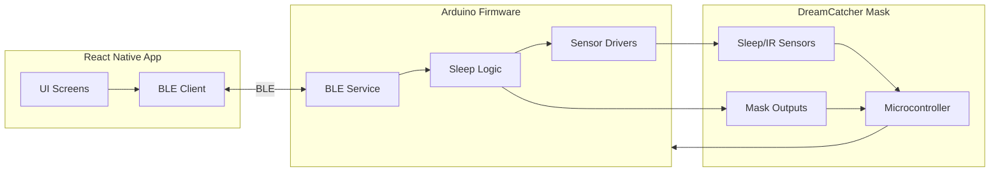
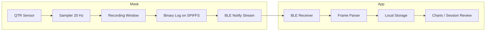
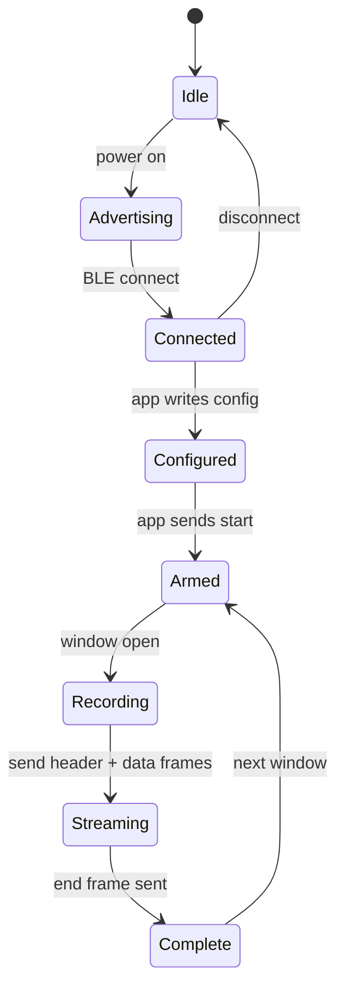

# DreamCatcher

DreamCatcher is a combined React Native mobile app and Arduino project for the DreamCatcher sleep mask hardware. This repository contains the mobile app used for configuring and interacting with the mask, plus Arduino sketches and libraries used on the hardware side.

Quick highlights
- Mobile app: built with React Native (folder: DreamCatcherAppNew)
- Arduino firmware + examples: under `arduino/` (multiple sketches and libraries)

Repository structure
- `DreamCatcherAppNew/` — React Native app (TypeScript + Metro). Run, build, and test instructions below.
- `arduino/` — Arduino sketches and supporting libraries. See `arduino/DreamCatcher_v2.2/` for the active mask firmware.
- `arduino/libraries/QTRSensors/` — Third-party sensor library included for IR/QTR sensors.

Architecture diagram (high level)

Data flow plan (mask -> app)
- Sampling: QTR sensor at 20 Hz during windowed recording sessions (later-night focus).
- Storage: binary log on SPIFFS (raw samples). CSV only for short debug captures.
- Transfer: BLE notifications in fixed-size chunks; app reassembles by sequence ID.
- Ingest: app stores per-night logs locally and optionally renders charts/summaries.
- Backfill: on reconnect, app requests the most recent session and fills any gaps.

Data flow diagram (detailed)

BLE payload shape (binary mode)
- Header (sent once per session): magic, version, sample rate, start timestamp.
- Data frames: sequence ID + N raw samples (uint16 each).
- End marker: session complete.

BLE frame layout (byte-level)
- Little-endian for all multi-byte fields.
- Frame type is the first byte of every notification.

Header frame (type 0x01)

| Field | Size (bytes) | Notes |
| --- | --- | --- |
| type | 1 | 0x01 |
| magic | 2 | ASCII "DC" |
| version | 1 | 0x01 |
| sample_rate_hz | 2 | 20 for now |
| start_epoch_s | 4 | Unix seconds |
| window_id | 1 | 0-255, increments per session |
| reserved | 1 | 0x00 |

Data frame (type 0x02)

| Field | Size (bytes) | Notes |
| --- | --- | --- |
| type | 1 | 0x02 |
| seq | 2 | Packet sequence, wraps |
| sample_count | 1 | Number of samples in payload |
| samples | 2 * N | uint16 raw values |

End frame (type 0x03)

| Field | Size (bytes) | Notes |
| --- | --- | --- |
| type | 1 | 0x03 |
| total_samples | 4 | Samples sent in this session |
| crc32 | 4 | Optional, set 0 if unused |

BLE state machine (firmware <-> app)

Command set (minimal)
- App -> mask: `cfg rate=20 window=60` (seconds), `cfg start_epoch=...`
- App -> mask: `start` (arm for next window), `stop` (cancel)
- App -> mask: `fetch last` (request last session)
- Mask -> app: header/data/end frames over notify

Size estimate
- 20 Hz raw sampling: $20\,\text{samples/sec} \times 2\,\text{bytes} = 40\,\text{B/sec}$
- One hour: $40\,\text{B/sec} \times 3600 \approx 144\,\text{KB}$
- 8 hours: about 1.15 MB (fits 1.3 MB SPIFFS with limited headroom)

Protocol decisions (current)
- Sampling rate: 20 Hz
- Recording mode: windowed recording in later-night window(s)
- Storage format: binary raw samples

Getting started — Mobile app
1. From `DreamCatcherAppNew/` install JS deps:

	npm install

2. iOS only: install CocoaPods from the `ios/` folder (macOS):

	npx pod-install ios

3. Run on Android (device or emulator):

	npx react-native run-android

4. Run on iOS (macOS + Xcode):

	npx react-native run-ios

Notes
- Node, npm (or yarn), and the React Native toolchain are required to run the app. Android Studio and Xcode are required for emulator / device builds on their respective platforms.

Getting started — Arduino
1. Open the relevant sketch (for example `arduino/DreamCatcher_v2.2/DreamCatcher_v2.2.ino`) in the Arduino IDE or PlatformIO.
2. Ensure libraries in `arduino/libraries/` are available to your IDE (they are included in this repo).
3. Select the correct board and upload.

Contributing
- Feel free to open issues or PRs for fixes, features, or documentation improvements.

License & Contact
- Check the `arduino/libraries/QTRSensors/LICENSE.txt` for the sensor library license. Add or confirm a top-level license file if you want an overall project license.
- Questions or help: open an issue in this repository.